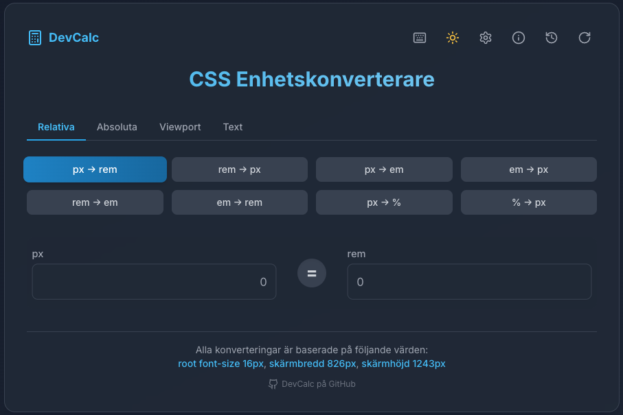

# DevCalc - CSS Enhetskonverterare

<div align="center">
  
  <p><em>DevCalc i modern mörk design</em></p>
</div>

## 📋 Beskrivning

DevCalc är en kraftfull CSS-enhetskonverterare utvecklad för att göra webbdesign och frontend-utveckling enklare. Med ett intuitivt användargränssnitt och omfattande konverteringsmöjligheter kan du snabbt och enkelt konvertera mellan olika CSS-enheter som px, rem, em, vh, vw och många fler.

### ✨ Huvudfunktioner

- **Omfattande enhetskonvertering** - Stöd för relativa, absoluta, viewport och text-baserade enheter
- **Anpassningsbara inställningar** - Anpassa root font-size, textparametrar och skärmstorlekar
- **Visuell förhandsgranskning** - Se hur dina konverterade enheter ser ut i mobil-, surfplatt- och desktop-vy
- **Smidiga tangentbordsgenvägar** - Öka din produktivitet med snabba kommandon
- **Konverteringshistorik** - Spara och återanvänd dina senaste konverteringar
- **Mörkt och ljust tema** - Bekväm användning i alla ljusförhållanden
- **Responsiv design** - Fungerar sömlöst på alla enheter

## 🚀 Komma igång

### Förutsättningar

- Node.js (v14 eller senare)
- npm eller yarn

### Installation

1. Klona repot:
   ```bash
   git clone https://github.com/your-username/devcalc.git
   cd devcalc
   ```

2. Installera beroenden:
   ```bash
   npm install
   # eller
   yarn install
   ```

3. Starta utvecklingsservern:
   ```bash
   npm run dev
   # eller
   yarn dev
   ```

4. Öppna [http://localhost:5173](http://localhost:5173) i din webbläsare

### Bygga för produktion

```bash
npm run build
# eller
yarn build
```

## 🔧 Enhetstyper och konverteringar

DevCalc stöder följande enhetstyper:

### Relativa enheter
- `px` ↔ `rem`
- `px` ↔ `em`
- `rem` ↔ `em`
- `px` ↔ `%`
- `%` ↔ `px`

### Viewport-enheter
- `px` ↔ `vh`
- `px` ↔ `vw`
- `vw` ↔ `vh`
- `px` ↔ `vmin`
- `px` ↔ `vmax`

### Absoluta enheter
- `px` ↔ `pt`
- `px` ↔ `cm`
- `px` ↔ `mm`
- `px` ↔ `in`

### Text-enheter
- `px` ↔ `ch`
- `px` ↔ `ex`
- `em` ↔ `ch`

## ⌨️ Tangentbordsgenvägar

DevCalc erbjuder ett stort antal tangentbordsgenvägar för att öka din produktivitet:

### Navigering
- `←` `→` - Växla mellan konverteringar
- `↑` `↓` - Byta mellan kategorier
- `Esc` - Stäng dialoger eller återställ värden

### Åtgärder (Ctrl/Cmd + ...)
- `C` - Kopiera resultat
- `R` - Återställ värden
- `P` - Visa/dölj förhandsgranskning
- `H` - Visa/dölj historik
- `S` - Öppna inställningar
- `I` - Visa information
- `D` - Byt tema (mörkt/ljust)

### Andra
- `?` - Visa tangentbordsgenvägar

## 🌐 Anpassa dina konverteringar

DevCalc låter dig anpassa:

- **Root font-size**: Ändra basen för rem/em-konverteringar
- **Teckens bredd**: Justera ch-enhetens bredd
- **X-höjd**: Anpassa ex-enhetens höjd
- **Skärmstorlek**: Ange egna skärmdimensioner för viewport-baserade enheter

## 💡 Teknisk information

DevCalc är byggd med:

- **React** - UI-bibliotek
- **TypeScript** - Typningssystem
- **Tailwind CSS** - Stilbibliotek
- **Vite** - Utvecklingsverktyg och byggprocess
- **Lucide Icons** - Ikonbibliotek

## 🤝 Bidra

Bidrag, problem och förfrågningar om funktioner är välkomna!

1. Forka repot
2. Skapa din feature-gren (`git checkout -b feature/amazing-feature`)
3. Commit dina ändringar (`git commit -m 'Add some amazing feature'`)
4. Push till grenen (`git push origin feature/amazing-feature`)
5. Öppna en Pull Request

## 📝 Licens

Distribuerad under MIT-licensen. Se `LICENSE` för mer information.

## 📬 Kontakt

Projektlänk: [https://github.com/your-username/devcalc](https://github.com/your-username/devcalc)

---

<div align="center">
  <p>Byggd med ❤️ av <a href="https://github.com/screamm">ditt användarnamn</a></p>
</div> 